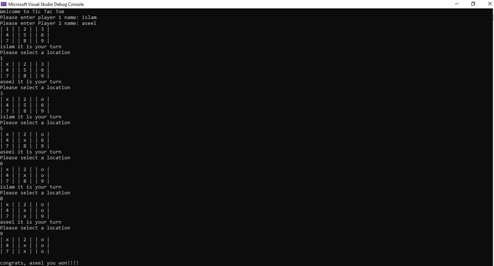

# Lab4_TicTacToe

### play tic toc toe game, and determin if there is a winner or not, firstly you will enter players names, then you will start playing each number that user choose is reflect on the board and will put marker given for user(x or o)

### if x is repeated 3 times in rows or columns or diagonals it will return congrats message and winner name, if there is no winner it will return draw no winner 

### How to run program
1- Clone project to your device 

2- Run program using  Debug > Start Without Debugging or ctrl + F5 and start the play

### How to use program

1- determin first player

2- determin second player 

3- let players take there turns to fill with determined marker(x or o).

4- prevent player to choose place that other player choosed, if he choose it will return error message that this position is occupied

5- print celebratory message for winner

6- print it's a draw if there is no winner

7- board for the game will keep apearing with filled user inputs

### Visual

### program contain some tests
